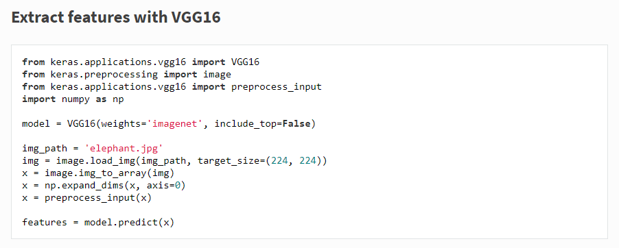

# Product Tagging

<h2> This is the project for tagging products based on their category. Labels are predicted for the product image provided. </h2>

<h2> Setup :- </h2>

 Python -- > Python 3.6.5 

 OS --> Windows 10 (OS build-->17763.253) (Version-->1809) 

 GPU --> Nvidia Geforce GTX 1060 (6gb) 

 CPU --> Intel Core i7-8750 @ 2.20GHz 

 RAM --> 16gb 

<h2> Step 1 -> Data Cleaning and Preparation :- </h2>
<h3>The image dataset can be cleaned and prepared from productsDataset.json file by running clean_prep.py</h3>

python clean_prep.py

Creates dataset folder in project folder with two subfolders -> train and test.

Images used for training will be downloaded in dataset/train folder.

Images used for testing can be put in dataset/test folder.

Checks for the products from the json file with the correct tag format, eg -> OUTERWEAR_JACKETS.

Checks for the products which contain atleast one image.

Downloads those images in their respective categories in dataset/train.

Discards other images.

<h2> Step 2 -> Extracting features from images in training dataset :- </h2>
<h3>The features can be extracted from the image dataset by running extract_features.py</h3>

python extract_features.py

Creates output folder in project folder.

Labels, Features, Models and Weights of images in our dataset are saved in output folder.

<h2>Step 3 -> Training on the image dataset :-</h2>
<h3>The model can be trained by running train.py</h3>

python train.py

Pre-trained VGG16 model is used.

All the layers of VGG16 other than top fully connected layer are left intact.

The fully connected layer is retrained on our dataset.

Dataset is split into 70% training data and 30% testing data.

Logistic Regression is used to retrain the last layer.

Could use a neural network to retrain the last layer in the future.

Classifier is saved in output folder.

<h2>Step 4 -> Testing on new data :-</h2>
<h3>The model can be tested by running test.py</h3>

python test.py

Put images to be tested in dataset/test folder.

Saved classifier is loaded.

Image is loaded and resized to 224x224 as input to VGG16 is of this size.

Features are extracted.

Prediction is made on test images put in dataset/test folder.

Predictions are printed on screen and saved in predicted_labels.txt(created automatically) in the folder project folder as well.

<h2> Links referenced :- </h2>

https://keras.io/applications/#vgg16

https://stackoverflow.com/questions/988228/convert-a-string-representation-of-a-dictionary-to-a-dictionary

https://scikit-learn.org/stable/modules/generated/sklearn.preprocessing.LabelEncoder.html

https://scikit-learn.org/stable/modules/generated/sklearn.model_selection.train_test_split.html

https://towardsdatascience.com/logistic-regression-using-python-sklearn-numpy-mnist-handwriting-recognition-matplotlib-a6b31e2b166a

https://www.learnopencv.com/keras-tutorial-transfer-learning-using-pre-trained-models/

https://www.analyticsvidhya.com/blog/2018/07/top-10-pretrained-models-get-started-deep-learning-part-1-computer-vision/

https://pillow.readthedocs.io/en/3.1.x/reference/Image.html

